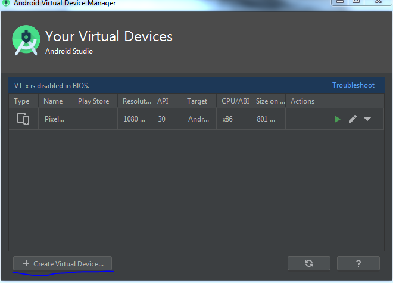

# Split-Expenses

> Implementation of mockups from UX classes AGH

## Official Documentation:
[Documentation](https://docs.nativescript.org/start/quick-setup#full-setup)

## Installation Steps (Windows):

* install Node and npm
* install NativeScript: run `npm install -g nativescript`

* install and configure JAVA (paths etc.)

* download [Android Studio](https://developer.android.com/studio)

* install Android Studio with default settings
* set ANDROID_HOME variable to the SDK path (in my case: `C:\Users\Rafal\AppData\Local\Android\Sdk\`)

* add platforms and platform-tool to the path (in my case `C:\Users\Rafal\AppData\Local\Android\Sdk\platforms` and `C:\Users\Rafal\AppData\Local\Android\Sdk\platform-tools\`)

* check if the requirements are met: `tns doctor`

If you see something like that, 

then you have to go to the 'SDK Manager' in Android Studio

 and download:

and

After that `tns doctor`

 should be:

## Creating Emulator:
* go to the `AVD Manager` in Android Studio
* create new emulator

* set resolution params for our app

* install Android image

* create emulator

## Launching:

* `git clone https://github.com/RafalJuraszek/Split-Expenses.git`

* `cd Split-Expenses
`
* `tns run android` 

After some time you should see something like that:

